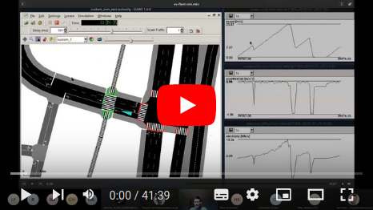

<!-- Note: This is a markdown file. Use a markdown editor to easily edit and
     view this file. Just search the web for a nice markdown editor (like
     Ghostwriter). -->

> Notice: Please visit https://gitlab.com/eputs/ev-fleet-sim to ensure that you
> are viewing the official, up-to-date version of this repository.

Electric-Vehicle Fleet Simulator
================================

This program is used to predict the energy usage of a fleet of electric vehicles. The program receives as input GPS traces of each of the vehicles of the fleet. These GPS traces can be obtained, for example, by installing tracking devices onto the vehicles of a fleet for which you want to predict the electrical energy usage. This is especially useful for projects whereby an existing petrol/diesel fleet is to be converted to electric vehicles. The program will analyse the vehicle's driving and stopping patterns in order to predict the amount of energy used and the amount of time that the vehicle can be charged during the average day. In addition, the program makes provisions to calculate how much of the energy can be provided for by renewable-energy sources.

Please refer to the accompanying open-access journal article publication: [Ray of hope for sub-Saharan Africa's paratransit: Solar charging of urban electric minibus taxis in South Africa](https://doi.org/10.1016/j.esd.2021.08.003). The article shows how this program can be used to derive meaningful results.

Licensing
=========

This software is [licensed under GPLv3](./LICENSE)

If you use the software, or a derivative thereof, you are required to attribute the original authors using the following citation:

> Abraham, C. J., Rix, A. J., Ndibatya, I., & Booysen, M. J. (2021). Ray of
> hope for sub-Saharan Africa's paratransit: Solar charging of urban electric
> minibus taxis in South Africa. Energy for Sustainable Development, 64,
> 118-127. https://doi.org/10.1016/j.esd.2021.08.003

<details><summary>Bibtex</summary>

```
@article{abraham2021,
title = {Ray of hope for sub-Saharan Africa's paratransit: Solar charging of urban electric minibus taxis in South Africa},
journal = {Energy for Sustainable Development},
volume = {64},
pages = {118-127},
year = {2021},
issn = {0973-0826},
doi = {https://doi.org/10.1016/j.esd.2021.08.003},
url = {https://www.sciencedirect.com/science/article/pii/S0973082621000946},
author = {C.J. Abraham and A.J. Rix and I. Ndibatya and M.J. Booysen},
keywords = {Electric vehicle, Paratransit, Minibus taxi, Demand management, Renewable energy},
abstract = {Minibus taxi public transport is a seemingly chaotic phenomenon in the developing cities of the Global South with unique mobility and operational characteristics. Eventually this ubiquitous fleet of minibus taxis is expected to transition to electric vehicles, which will result in an additional energy burden on Africa's already fragile electrical grids. This paper examines the electrical energy demands of this possible evolution, and presents a generic simulation environment to assess the grid impact and charging opportunities. We used GPS tracking and spatio-temporal data to assess the energy requirements of nine electric minibus taxis as well as the informal and formal stops at which the taxis can recharge. Given the region's abundant sunshine, we modelled a grid-connected solar photovoltaic charging system to determine how effectively PV may be used to offset the additional burden on the electrical grid. The mean energy demand of the taxis was 213kWh/d, resulting in an average efficiency of 0.93kWh/km. The stopping time across taxis, a proxy for charging opportunity, ranged from 7.7 h/d to 10.6 h/d. The energy supplied per surface area of PV to offset the charging load of a taxi while stopping, ranged from 0.38 to 0.90kWh/m2 per day. Our simulator, which is publicly available, and the results will allow traffic planners and grid operators to assess and plan for looming electric vehicle roll-outs.}
}
```

</details>

Documentation
=============

To learn how to install and use this software, please refer to the [documentation](https://eputs.gitlab.io/ev-fleet-sim/):

<a href="https://eputs.gitlab.io/ev-fleet-sim/docs.html">
<button>To the Documentation!</button>
</a>

If you learn better with videos, here is a video tutorial of the software:

<a href="https://youtu.be/vhiw34Hm7CI" target="_blank" rel="noopener noreferrer"></a>

Getting Support
===============

Welcome to our EV-Fleet-Sim community! You can join our community's Matrix
channel (an open-source alternative of Microsoft Teams):
https://matrix.to/#/#ev-fleet-sim:matrix.org.

For more help, please don't hesitate to contact me on my e-mail address: 
`chris <abraham-without-the-A's> [at] gmail [dot] com` or via Matrix:
https://matrix.to/#/@abrac:matrix.org.

If you have encountered any issues/bugs with the software, you can report them in our [issues tracker](https://gitlab.com/eputs/ev-fleet-sim/-/issues).

Also remember to press the "star" and "notification bell" on the top of the
GitLab page. That way, you will be notified of the latest commits and
pull-requests.
